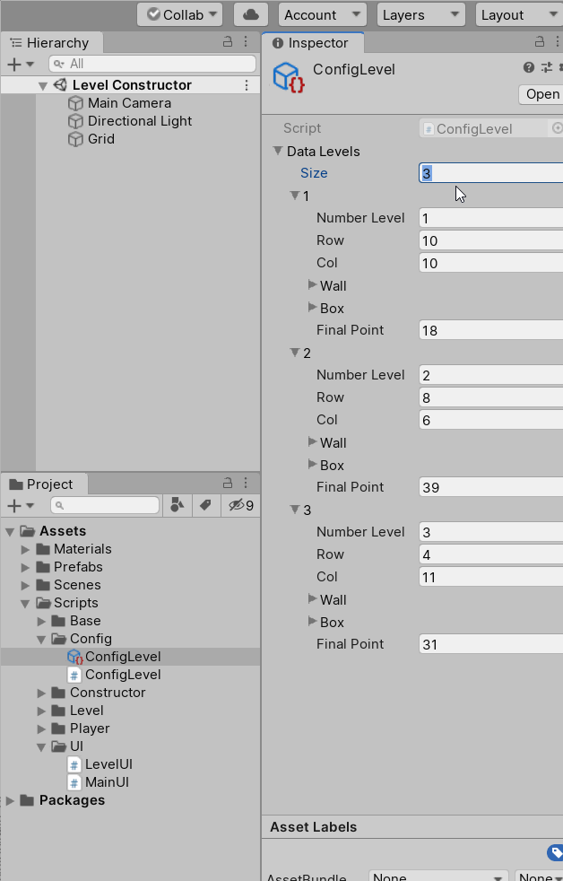
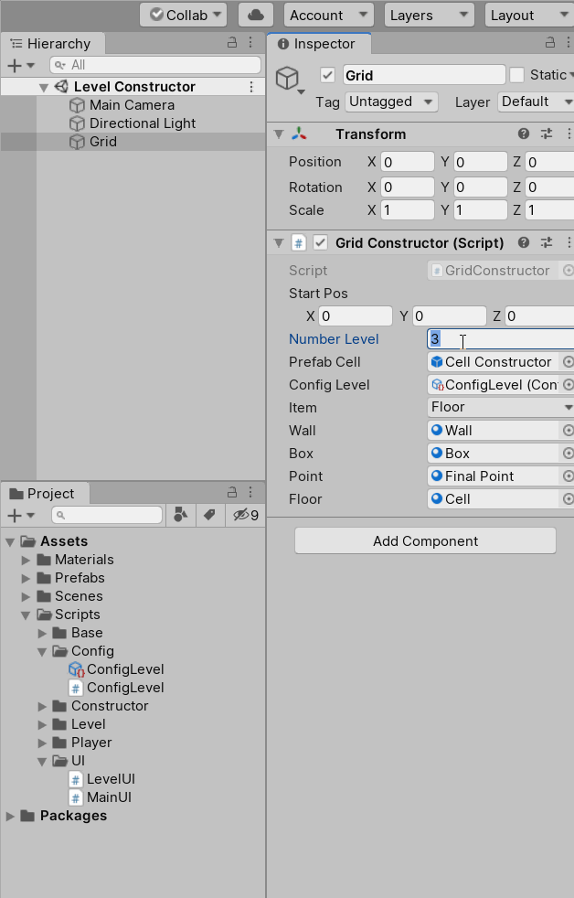
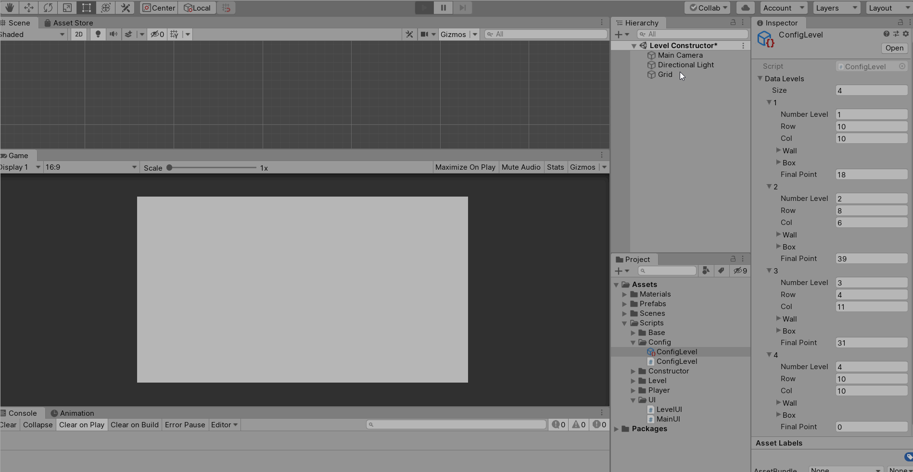
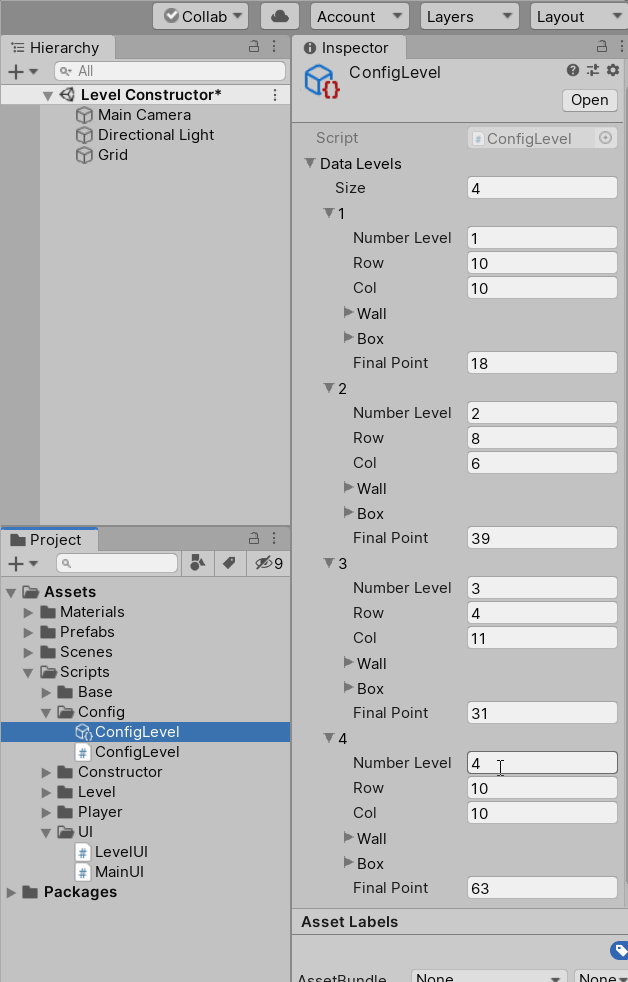
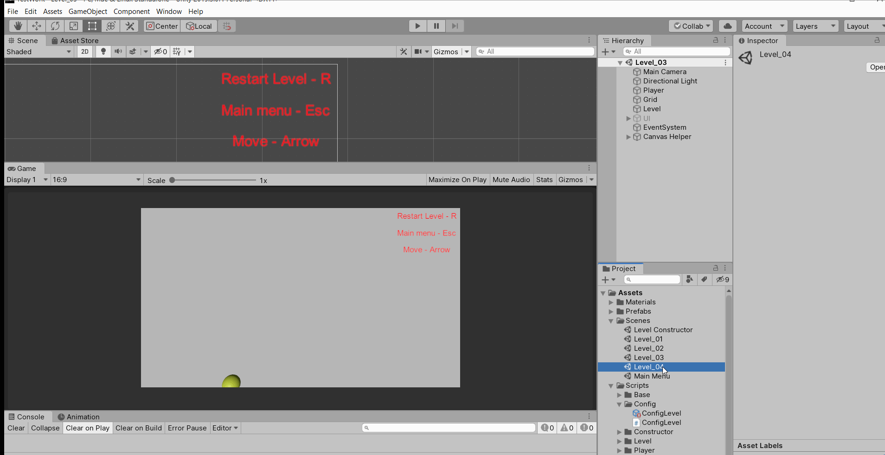

# TestWork

Привет! Хочу ещё пояснить, как работает мой "великолепный" конструктор уровней :)  

***
Сначала добавляем новый уровень в ассет. Указываем номер, размер поля. Дальше переходим на сцену конструктора.  

***
Указываем какой уровень хотим редактировать и нажимаем play.  

***
В компоненте Grid выбираем из списка тип объекта - это коробка, стена, пол и ячейку перехода. В ассете хранятся все номера ячеек с объектами.
Дальше проверяем в ассете, что всё сохранилось.  

***
Последний этап - это проверка уровня. Создаём новый левел(можно было пересоздавать всё в одном уровне, но я выбрал вариант для ленивых).  

Буду рад любой критике. 